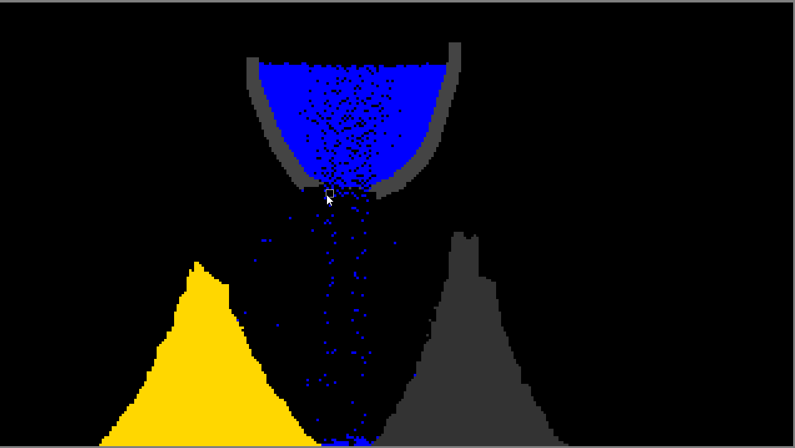
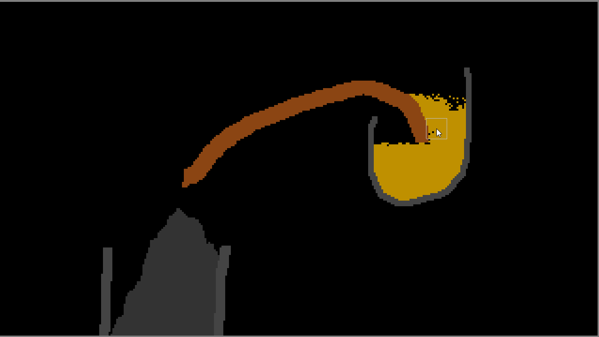
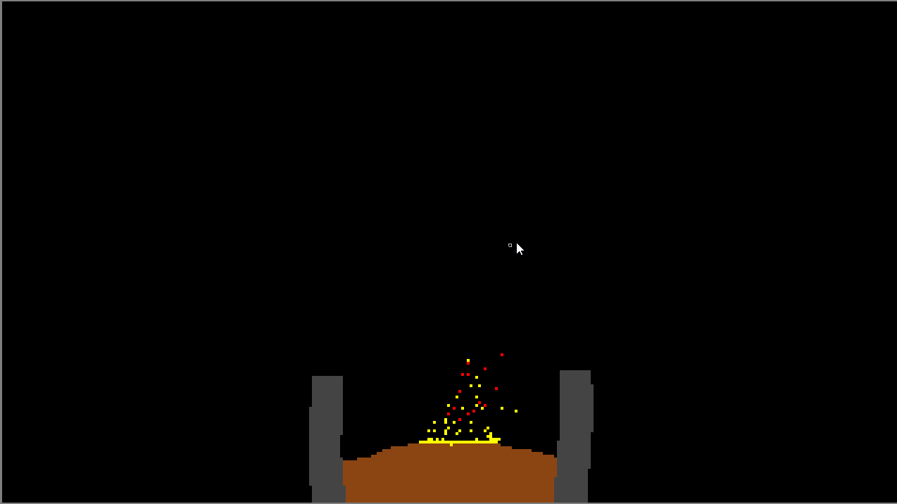

# FallingSand

Simple falling sand game made
as individual project for WUT.
Built with Java and LibGDX framework.

Controls:
* Pause -> SPACE
* Speed up -> '>'
* Speed down -> '<'
* Spawn cells -> left click
* Open cell menu -> right click
* Shrink brush -> scroll down
* Enlarge brush -> scroll up

## Results
Different types of cells: solids, fluids, loose materials

Flammable materials such coal, wood and petrol.

